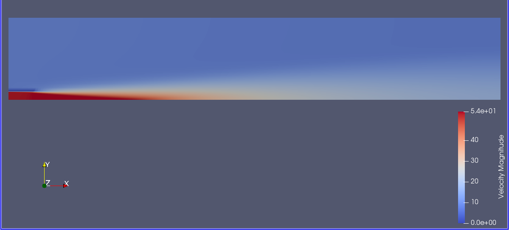

# Deliverable 2: Set up a test case from scratch
This deliverable demonstrates how to set-up a test case from scratch. The test case is that of an axisymmetric, steady-state turbulent jet.

## References
This is a well documented test case, and we can find many references describing experimental and numerical results. The experimental results of Schefer are, for example, provided in the following report:
'Data Base for a Turbulent, Nonpremixed, Nonreacting Propane-Jet Flow', by R. W. Schefer, https://tnfworkshop.org/wp-content/uploads/2019/02/SandiaPropaneJet.pdf

## Set-up
We now describe the steps to generate the test case.

### Mesh
First, we prepare the computational mesh. We use gmsh in its python package version to implement a simple script [mesh_generator.py](./mesh_generator.py) that is configurable to generate the sought mesh. The mesh generator already implies an hypothesis of axisymmetry along the jet axis, which reduces the domain to a 2-Dimensional rectangle due to the symmetry of the problem. Therefore, just need to impose the jet radius R_jet = 0.005 and scale the domain by 60 times along the stream-wise direction and 10 times along the span-wise direction. This results in a rectangle whose long sides form the symmetry axis and the far field axis and whose short sides correspond to the inlet and outlet sides. 
We intend to generate the jet by imposing a velocity boundary condition on the inlet side, with a small section having a fast velocity corresponding to the jet, and the rest of the inlet feeling a lower velocity. For this reason, we split the inlet side in two. Moreover, this inlet velocity profile corresponds to a hat profile, introducing thus a discontinuity at R_jet, where the fast and slow moving flows touch abruptly. This discontinuity could be tricky to handle numerically, therefore we introduce a no-slip boundary condition parallel to the flow, to allow for the boundary layers to develop in that region. This wall is scaled as 5% of the stream-wise domain length.
Finally, the mesh is completed by mapping the inlet separation and the no-slip extra boundary onto the corresponding, parallel walls in order to generate a proper hortogonal mesh. This results in four sub-surfaces which are finally merged to generate the fluid physical group. This separation also allows us to generate a finer mesh in correspondence of the jet, especially at the inlet.

### Configuration file
The configuration file [config.cfg](./config.cfg) is then prepared. We run incompressible RANS for standard air with the SST turbulence model. AS mentioned, the configuration is axisymmetric, which significantly reduces the computational cost.
We specify the inlet jet velocity at 53.0 m/s, 5% turbulent, while the inlet environment is set to 9.0 m/s, 0.005% turbulent, both directed along the stream-wise direction. We do not consider two different scalars for the jet and the surrounding fluid, further reducing the computational cost of the simulation. Results might be mildly affected by this approximation, but we are mostly interested in matching the velocity statistis, and not the transport of scalars.

## Results
The simulation is run with the 'SU2_CFD config.cfg' command. The screen output is displayed in the [out.out](./out.out) file.
The final velocity field is visualized in the following figure. Here, we can appreciate the fast jet (in red) as well as the slow surrounding flow, with the no-slip boundary condition in dark blue. We see that the jet rapidly decays, showing the typical tail.

