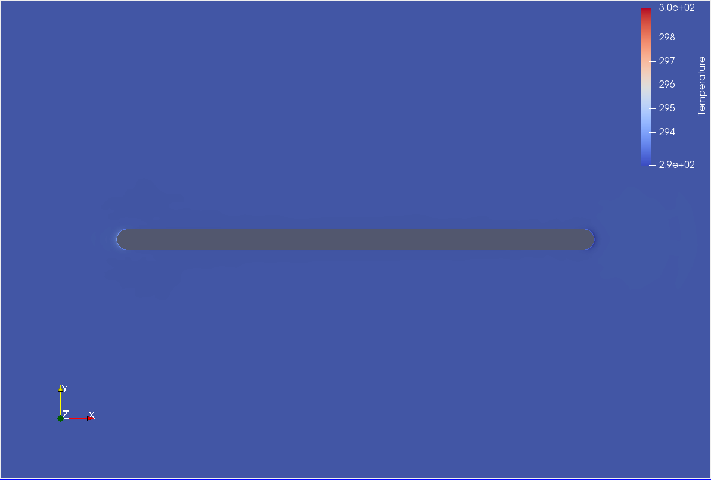
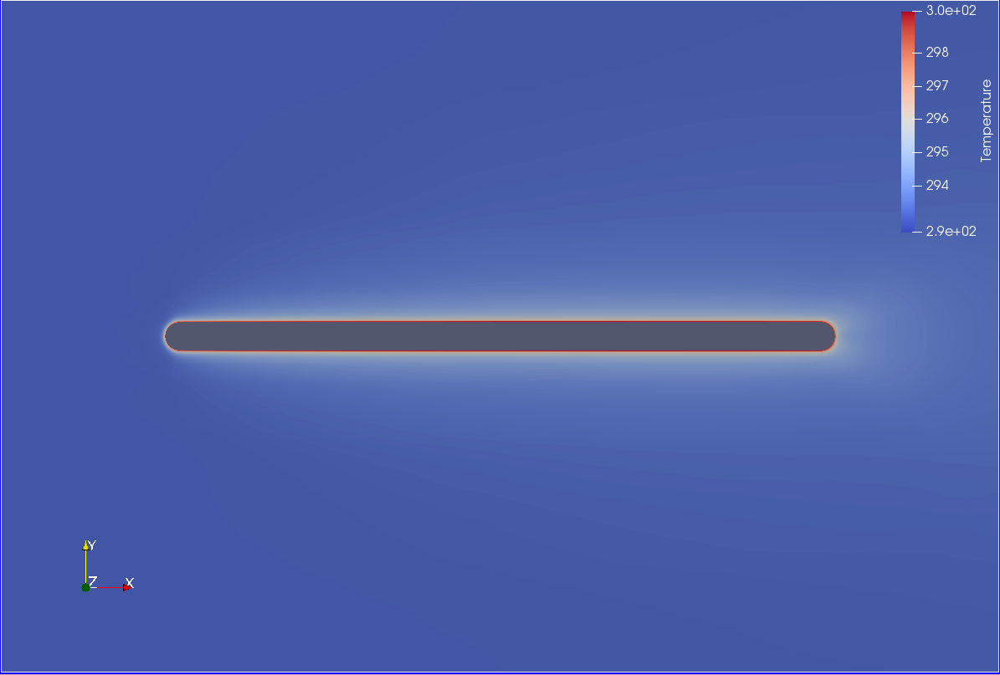
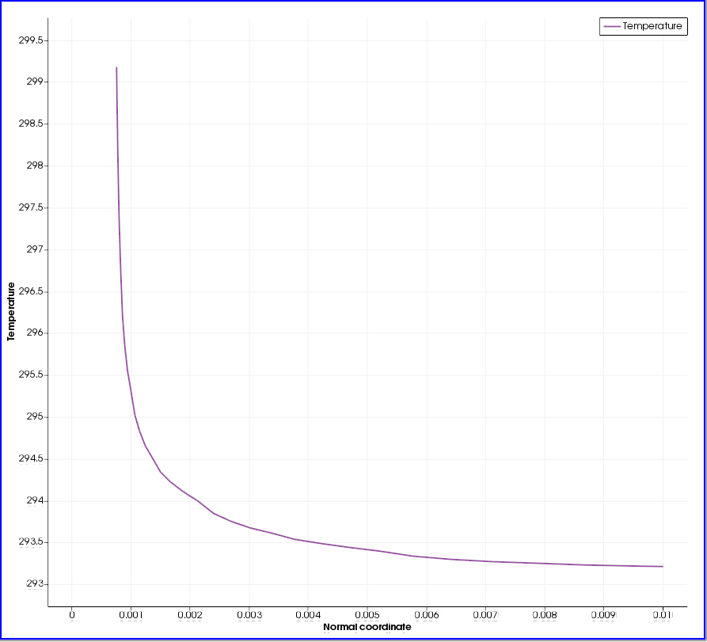

# Deliverable 3: Python wrapper test case

## Build
SU2 was compiled from source using the built-in Meson builder with the python flag enabled. This was the most straightforward way of building the software and running the test case. By doing so, the solver is launched with the following command: python launch_unsteady_CHT_FlatPlate.py --file unsteady_CHT_FlatPlate_Conf.cfg

## Test case
The selected test case is a 2D unsteady heated flat plate for Conjugate Heat Transfer. 
This problem is solved using a RANS approach with teh SST turbulence model.

#### Fluid:
 - standard air
#### Flow conditions:
 - Reynolds number 24407.3
 - Mach number: 0.03059
#### Homogeneous unsteady wall temperature on the heated flat plate: 
 - WallTemp = 293.0 + 57.0 * sin(2*pi*time)

## Results
At the initial time-step, the thermal boundary layer has not yet developed, as the plate and the surrounding fluid are in a near-uniform temperature configuration.

At the final time-step, the thermal boundary layer has clearly developed, as the heat is diffusing from the flat plate to the surrounding fluid 

The thermal boundary layer is clearly visible when we plot the temperature profile along the wall-normal coordinate in the middle of the flat plate, at the final time instant.

