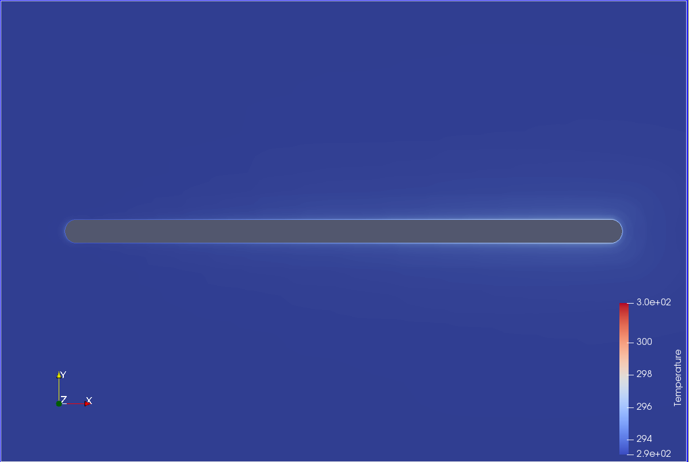
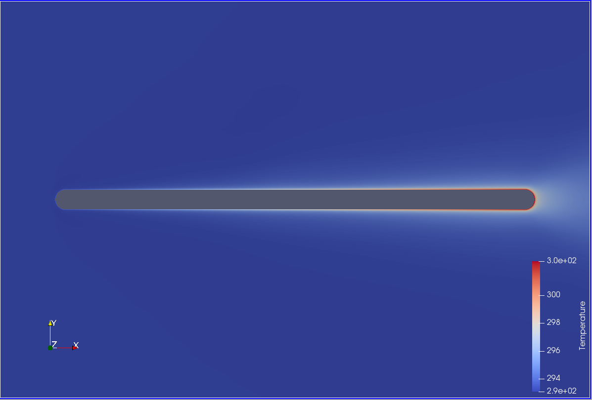
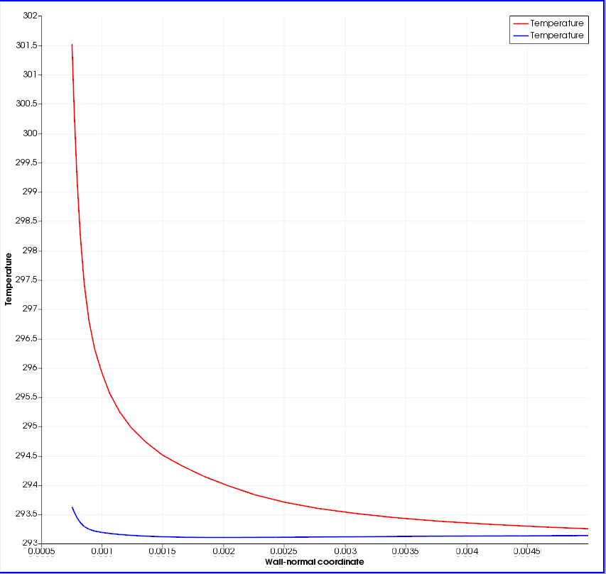

# Deliverable 4: Modification of the python wrapper setup

## Test case
With regards to the previous test case, we introduce here a spatially varying wall temperature for the flat plate.
This is obtained with the following modifications of the python launch file, at line 99:

  # get the plate marker
  allMarkers = SU2Driver.GetMarkerIndices()
  CHTMarkerID = allMarkers['plate'] 
  # get the number of nodes on the plate
  nNodes = SU2Driver.GetNumberMarkerNodes(CHTMarkerID)
  # get the coordinates view, (x,y) tuples accessible as x,y = coords.Get(index)
  coords = SU2Driver.MarkerCoordinates(CHTMarkerID)

  # convert to a standard list of tuples to get the min and max
  points = [coords.Get(i) for i in range(coords.Shape()[0])]
  x_coords = [p[0] for p in points]
  x_min, x_max = min(x_coords), max(x_coords)

  # set a spatially varying temperature profile
  for i in range(nNodes):
    # get the coordinates
    x,_ = coords.Get(i)
    # set the temperature
    WallTemp = 293.0 + 10.0 * (x-x_min)/(x_max-x_min)    
    SU2Driver.SetMarkerCustomTemperature(CHTMarkerID, i, WallTemp)

We manipulate the coordinates through the SU2Driver and convert them to a list to get the minimum and maximum extents in order to calculate a linear spatially varying temperature profile along the flat plate mesh. Using the mesh ID integer would not be correct as the nodes IDs loop around its perimeter.
We then loop over the number of nodes and get the local coordinates to calculate the local temperature through the formula '293.0 + 10.0 * (x-x_min)/(x_max-x_min)' before setting it through the SU2 driver.

## Results
The presented approach is effective in creating a linearly varying temperature profile along the horizontal coordiante of the mesh.

We first look at the temperature field at the initial time-step, and we can appreciate the moderate temperature increment along the mesh, from left to right, as a mild colour variation.

We then consider the temperature field at the final time-step of the simulation. It is clear that the field has now developed more, and we can appreciate a stark difference between the left and right sides of the flat plat. Whereas on the left side the condition is nearly iso-thermal, on the right side the temperature boundary layer is clearly visible.

We can further verify the development of the thermal boundary layer by looking at the temperature variation along the wall-normal coordiate. We consider this at two different locations of the flat plate, i.e. x=-0.015 (cold profile in blue) and x=0.015 (hot profile in red), both at the final time-step of the simulation. We can easily spot the different extension of the thermal boundary layer between the cold and hot profiles, which confirms the success of the python wrapper modification.

