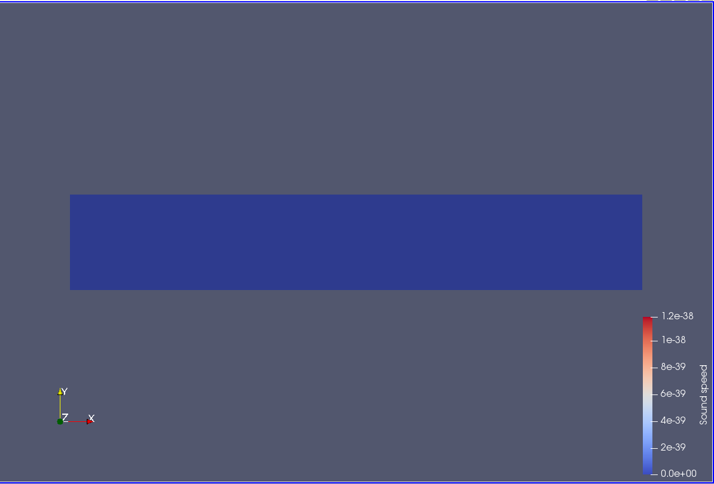

# Deliverable 5: Addition of new volume output

This deliverable describes the addition of the speed of sound, as calculated natively by SU2, to the screen and volume output.
As the speed of sound must be natively calculated by SU2, I initially tried to output it by adding 'SOUND_SPEED' to the VOLUME_OUTPUT item within the configuration file. Yet, this was not sufficient as SU2_CFD was constantly rejecting it from the VOLUME_OUTPUT fields list, as displayed in the start-up print of the simulations. This was most probably due to the fact that the INC_RANS solver is meant for incompressible flows, where the speed of sound calculations have no relevance.
Therefore, I deduced that it was necessary to allow the calculation of the speed of sound by modidying the source code of SU2_CFD. 

This required the following modifications:
 - first, the speed of sound had to be included among the allowed volume output fields for the INC_RANS solver. This was implemented within the following method:
void CFlowIncOutput::SetVolumeOutputFields(CConfig *config)
    ...
   AddVolumeOutput("SOUND_SPEED", "Sound speed", "SOLUTION", "Sound speed");
    ...
 - second, the speed of sound had to be actually recovered from the solver at each volume output generation. This was implemented within the following method:
void CFlowIncOutput::LoadVolumeData(CConfig *config, CGeometry *geometry, CSolver **solver, unsigned long iPoint){
  ...
  SetVolumeOutputValue("SOUND_SPEED", iPoint, Node_Flow->GetSoundSpeed(iPoint));
  ...
Concerning the screen output, it was then straightforward to define a Macro that would calculate the average speed of sound on a specific part of the mesh and add it to the screen plot:

SCREEN_OUTPUT= ... a_avg
%
% ------------- MACRO ---------------%
%
CUSTOM_OUTPUTS= 'a : Macro{SOUND_SPEED};\
                 a_avg : AreaAvg{$a}[outlet];'

Finally, it was possible to load the volume output files and display the speed of sound:

It was disappointing to see that the displayed field is set to zero all over the domain. This implies that the local speed of sound might be updated only for specific models of fluid, which are not being considered in the current configuration of the INC_RANS solver. 